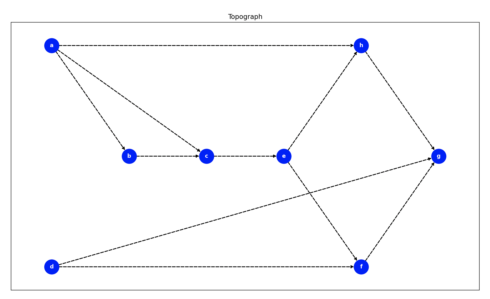

# goit-algo-hw-06

### Basics algorithms and Data Structures 
#### Master of degree from university

*Завдання 1*

Створіть граф за допомогою бібліотеки networkX для моделювання певної реальної мережі (наприклад, транспортної мережі міста, соціальної мережі, інтернет-топології).

Візуалізуйте створений граф, проведіть аналіз основних характеристик (наприклад, кількість вершин та ребер, ступінь вершин).

*Завдання 2*

Напишіть програму, яка використовує алгоритми DFS і BFS для знаходження шляхів у графі, який було розроблено у першому завданні.

Далі порівняйте результати виконання обох алгоритмів для цього графа, висвітлить різницю в отриманих шляхах. Поясніть, чому шляхи для алгоритмів саме такі.

*Завдання 3*

Реалізуйте алгоритм Дейкстри для знаходження найкоротшого шляху в розробленому графі: додайте у граф ваги до ребер та знайдіть найкоротший шлях між всіма вершинами графа.

### Інформація про граф

```
Graph Info:
Nodes count: 8
Edge count:11
Density: 0.19643
```

### Візуалізація


### Результати досліджень алгоритмів DFS і BFS
## DFS
```e h g f ```

## BFS
```e h f g```


### DFS (Depth-First Search) алгоритм
Пошук у глибину (DFS) виконується шляхом відвідування вершини, а потім рекурсивного відвідування всіх сусідніх вершин, які ще не були відвідані. Результати можуть бути не впорядковані за "короткістю" шляхів, і можуть залежати від порядку обходу.

### BFS (Breadth-First Search) алгоритм
Пошук у ширину (BFS) відрізняється від DFS тим, що він відвідує всі вершини на певному рівні перед тим, як перейти до наступного рівня. Це забезпечує знаходження найкоротших шляхів від початкового вузла до всіх інших вузлів.

## Висновки
1. DFS може виводити шляхи в довільному порядку, в залежності від того, як обираються сусіди на кожному етапі.
2. BFS гарантує знаходження найкоротших шляхів, оскільки він розглядає всі можливі варіанти на одному рівні перед переходом на наступний рівень.
3. У випадку, коли граф є деревом або не має циклів, обидва алгоритми повинні виводити однакові результати щодо шляхів.

Вибір між алгоритмами пошуку в глибину (DFS) та пошуку в ширину (BFS) визначається конкретною структурою графа та задачею, яку треба розв’язати. Наприклад, BFS ефективно знаходить найкоротший шлях у незважених графах, незалежно від їхньої ширини чи глибини. Тому немає строгих правил щодо вибору між DFS та BFS на основі ширини або глибини графа.